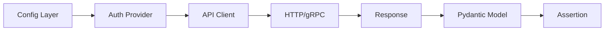

# SDET Portfolio Blueprint — The Gold Standard GitHub Presence

**Purpose:** Transform your GitHub profile from "a collection of tutorials" into a living proof of senior SDET engineering capability.  
**Companion docs:** `Master_SDET_Implementation_Plan.md` (skills), `Practical_Performance_Guide.md` (perf testing), `SDET_Innovation_Lab.md` (tools).  
**Philosophy:** Every architectural decision in this document exists because a hiring manager or tech lead will read your repo in under 5 minutes. Those 5 minutes must communicate: *this person thinks in systems, not scripts.*

---

## Table of Contents

- [Part 1: The Architecture of a Showcase Repository](#part-1-the-architecture-of-a-showcase-repository)
- [Part 2: README Engineering](#part-2-readme-engineering)
- [Part 3: Dockerization — Thinking in Environments](#part-3-dockerization--thinking-in-environments)
- [Part 4: CI/CD Pipeline — Thinking in Feedback Loops](#part-4-cicd-pipeline--thinking-in-feedback-loops)
- [Part 5: Retry-on-Failure — Thinking in Resilience](#part-5-retry-on-failure--thinking-in-resilience)
- [Part 6: Configuration Management — Thinking in Portability](#part-6-configuration-management--thinking-in-portability)
- [Part 7: The GitHub Profile as a Product](#part-7-the-github-profile-as-a-product)

---

## Part 1: The Architecture of a Showcase Repository

### 1.1 Why Directory Structure Matters

A directory structure is your first architectural statement. Before a reviewer reads a single line of code, they `tree` your repo. What they see in 3 seconds tells them whether you think in layers or think in files.

The difference between a junior and senior structure:

**Junior (script-thinker):**
```
tests/
  test_login.py
  test_api.py
  helpers.py
  config.py
```

**Senior (systems-thinker):**
```
project-root/
├── src/                        # Framework source code (importable package)
│   ├── __init__.py
│   ├── core/                   # Cross-cutting concerns
│   ├── clients/                # API client layer
│   ├── models/                 # Data models (Pydantic)
│   ├── pages/                  # Page Objects (UI layer)
│   └── utils/                  # Pure utility functions
├── tests/                      # Test code (never imported by src/)
│   ├── api/                    # API tests
│   ├── ui/                     # UI tests
│   ├── integration/            # Cross-layer tests
│   └── conftest.py             # Pytest configuration
├── config/                     # Environment configurations
├── data/                       # Test data fixtures (JSON, CSV)
├── infra/                      # Docker, K8s, Terraform
├── reports/                    # Generated reports (.gitignored)
├── .github/                    # CI/CD workflows
├── docs/                       # Architecture decisions
└── scripts/                    # Automation shell scripts
```

### 1.2 The Reasoning Behind Every Folder

Do not memorize this structure. Understand the *principles* that produce it, so you can design structures for any project.

#### Principle 1: Separation of Framework from Tests

```
src/          ← The framework. Reusable across projects.
tests/        ← The tests. Specific to THIS product.
```

**Why:** Your API client, retry logic, and config manager are *tools*. They should be importable as a package (`from src.clients.base import BaseClient`). Your tests *consume* these tools. If you mix them, you cannot reuse the framework elsewhere, and you cannot test the framework itself.

**Mental model:** Think of `src/` as a library you publish. Think of `tests/` as a consumer of that library.

**How to internalize this:** Take any flat test file you've written. Ask: "Which lines are about *how* to talk to the system (framework)?" and "Which lines are about *what* to verify (test logic)?" Move them into separate files. That discomfort you feel separating them is the exact muscle you need to build.

#### Principle 2: Layered Abstraction

```
src/
├── core/       ← Retry, logging, base classes, decorators
├── clients/    ← HTTP/gRPC/GraphQL client wrappers
├── models/     ← Request/response data structures
├── pages/      ← UI page objects
└── utils/      ← Stateless helpers (date formatting, string ops)
```

Each layer has a single responsibility and a clear dependency direction:

```
utils/  ←  core/  ←  clients/  ←  pages/
                  ←  models/
```

- `utils/` depends on nothing internal. Pure functions.
- `core/` depends on `utils/`. Defines base behaviors (retry, logging config).
- `clients/` depends on `core/` and `models/`. Knows how to talk to services.
- `models/` depends on nothing internal. Pure data definitions.
- `pages/` depends on `clients/` (for hybrid API+UI tests) and `core/`.

**Why this matters:** When a test fails, this structure tells you *where* to look. A 500 error? It's in `clients/`. A wrong field? It's in `models/`. A flaky timeout? It's in `core/retry.py`. A UI locator broke? It's in `pages/`.

**How to internalize this:** Draw a dependency diagram of your current code. If arrows go in circles (A imports B imports A), you have a design problem. Refactor until all arrows point in one direction.

#### Principle 3: Configuration as a First-Class Layer

```
config/
├── __init__.py
├── settings.py         # Pydantic BaseSettings
├── environments/
│   ├── local.env
│   ├── staging.env
│   └── production.env
└── constants.py        # Immutable values
```

**Why a separate `config/` instead of scattering `os.environ.get()` everywhere:** Configuration is a cross-cutting concern. Every layer needs it (clients need base URLs, tests need credentials, pages need timeouts). If config logic leaks into 15 files, changing an environment variable name requires a 15-file commit.

**How to internalize this:** Search your codebase for `os.environ`. Count how many files contain it. If it's more than 2, you need a config layer.

#### Principle 4: Infrastructure as Code, Not Afterthought

```
infra/
├── docker/
│   ├── Dockerfile
│   ├── Dockerfile.ci          # Slim image for CI
│   └── docker-compose.yml
├── k8s/                       # Optional: K8s manifests
└── terraform/                 # Optional: Cloud infra
```

**Why `infra/` is separate from `.github/`:** GitHub Actions is *one* CI system. Your Docker config, your Compose setup, your Terraform — these are infrastructure decisions that outlive any CI vendor. Separating them means switching from GitHub Actions to GitLab CI requires zero changes to `infra/`.

#### Principle 5: Tests Mirror the System Under Test

```
tests/
├── api/
│   ├── test_users.py
│   ├── test_auth.py
│   └── test_organizations.py
├── ui/
│   ├── test_login_flow.py
│   └── test_dashboard.py
├── integration/
│   └── test_user_lifecycle.py   # API creates → UI verifies
└── conftest.py
```

**Why organized by domain, not by type:** "All GET tests" in one file is useless organization. When a user feature breaks, you want to find `test_users.py`, not scan through `test_get_requests.py`, `test_post_requests.py`, and `test_delete_requests.py`.

**How to internalize this:** Name your test files after the *thing they protect*, not the *technique they use*.

### 1.3 The `.gitignore` Engineering

Your `.gitignore` is a statement about what matters (tracked) vs what is generated (ignored).

```gitignore
# Generated artifacts — never commit
reports/
allure-results/
*.html
screenshots/

# Environment — local to each developer
.env
*.env.local
.venv/
__pycache__/

# IDE — personal preference
.idea/
.vscode/
*.code-workspace

# OS artifacts
.DS_Store
Thumbs.db

# Docker
*.tar

# Build
dist/
*.egg-info/
```

**Why this is engineering, not housekeeping:** Committing a 50MB Allure report or a `.env` with credentials isn't just messy — it's a security risk and a repository bloat problem. Treat `.gitignore` as a security boundary.

---

## Part 2: README Engineering

### 2.1 What a README Communicates in 30 Seconds

A hiring manager reads your README in this order:
1. **Title + one-line description** (2 seconds): What is this?
2. **Badges** (3 seconds): Does CI pass? Is it maintained?
3. **Architecture section** (10 seconds): Is this person a systems thinker?
4. **Tech Stack** (5 seconds): Do their skills match what I need?
5. **Setup instructions** (10 seconds): Can I run this myself?

If any of these are missing or weak, they close the tab.

### 2.2 Professional README Template

Below is a structural template. Do not copy it verbatim — understand what each section *proves* about you, then write your own version that reflects your actual project.

```markdown
# Project Name

One-line description: what this framework does and what system it tests.


---

## Architecture

> Diagram or description of the layered architecture.
> This section proves you think beyond "write test, run test."

(Include a text-based or Mermaid diagram showing layers)

## Tech Stack

| Layer | Technology | Why |
|-------|-----------|-----|
| Framework | pytest + pytest-bdd | BDD for readability; pytest for fixtures/hooks |
| API Client | requests + urllib3 Retry | Session pooling, exponential backoff |
| Models | Pydantic v2 | Typed response validation |
| UI | Playwright (Python) | Auto-waiting, trace viewer, network interception |
| Data | Factory Boy + Faker | Reproducible, seeded test data |
| Reporting | Allure | Step-level visibility, history trends |
| CI/CD | GitHub Actions | Matrix builds, smart test selection |
| Containers | Docker + Compose | Isolated, reproducible execution |
| Config | Pydantic BaseSettings | Type-safe, env-aware configuration |

## Design Patterns

| Pattern | Where Used | Why |
|---------|-----------|-----|
| Factory | `src/data/factories.py` | Consistent test entity creation |
| Strategy | `src/core/auth/` | Swappable auth mechanisms |
| Page Object | `src/pages/` | UI locator encapsulation |
| Builder | `src/clients/request_builder.py` | Complex request construction |
| Adapter | `src/clients/base.py` | Unified interface for HTTP/gRPC |

## Prerequisites

- Python 3.11+
- Docker & Docker Compose
- Poetry (`pip install poetry`)

## Quick Start

(Three commands maximum to go from clone to green tests.)

## Project Structure

(The tree from Part 1, with one-line annotations.)

## Running Tests

(Commands for: all tests, smoke only, API only, UI only, parallel.)

## CI/CD

(What the pipeline does, link to workflow file, what triggers it.)

## Contributing

(How to add a new test domain, naming conventions, PR checklist.)
```

### 2.3 What Makes a README "Senior-Level"

The template above is a skeleton. What elevates it:

**Architecture diagram:** A Mermaid diagram in your README that shows data flow (Config → Client → API → Response → Model → Assertion) proves you can communicate architecture visually. Interviewers screenshot these.



**"Why" column in Tech Stack:** Listing "pytest" means nothing. Writing "pytest — fixture-based DI, hook extensibility, xdist parallelism" proves you chose it deliberately.

**Design Patterns section:** This is the single biggest differentiator. Most SDETs cannot name the patterns they use. You will.

**How to build this skill:** After every file you create, ask: "If I delete this file, what else breaks and why?" If the answer is "everything breaks," your coupling is too high. If the answer is "nothing breaks," the file might not be needed.

---

## Part 3: Dockerization — Thinking in Environments

### 3.1 Why Docker Matters for Your Portfolio

Docker in a test repository proves one thing: **you understand that tests are software, and software needs controlled environments.**

When a hiring manager sees a Dockerfile in your test repo, they immediately know:
- You've dealt with "it works on my machine" problems
- You can run tests in CI without environment drift
- You understand the build → ship → run lifecycle

### 3.2 The Mental Model Before the Code

Before writing a Dockerfile, understand what problem you're solving:

**Problem 1: Dependency hell.** Your tests need Python 3.11, Playwright browsers, system libs (libpq for Postgres, libssl for TLS). Different machines have different versions. Docker freezes this.

**Problem 2: CI reproducibility.** Your CI runner is a clean VM. You need to install everything from scratch every run, or you need an image with everything pre-baked.

**Problem 3: Local development.** New team member joins. Instead of a 2-hour setup guide, they run `docker compose up` and get a working environment.

### 3.3 Dockerfile — Understanding Each Decision

Do not copy a Dockerfile. Understand what each instruction does and *why* it's in that order.

**The layering principle:** Docker builds images in layers. Each instruction creates a layer. Layers are cached. If a layer changes, all subsequent layers are rebuilt. Therefore: **put things that change rarely at the top, and things that change frequently at the bottom.**

```
Things that change RARELY (top of Dockerfile):
  - Base image selection
  - System package installation
  - Browser installation (for Playwright)

Things that change SOMETIMES:
  - Poetry/pip dependency installation

Things that change FREQUENTLY (bottom of Dockerfile):
  - Your test code COPY
```

**The multi-stage principle:** You don't need build tools in the final image. A builder stage installs everything; the final stage copies only what's needed. This reduces image size from 2GB to 400MB.

**How to learn this by doing, not copying:**

1. Write the simplest possible Dockerfile: `FROM python:3.11` → `COPY . .` → `RUN pip install -r requirements.txt` → `CMD ["pytest"]`
2. Build it. Time the build. Note the image size (`docker images`).
3. Change one test file. Rebuild. Notice that `pip install` runs again even though no dependencies changed. Ask yourself: *why?*
4. Fix it: move `COPY requirements.txt .` and `RUN pip install` *before* `COPY . .`. Rebuild after a test change. Notice `pip install` is cached. You just learned layer caching.
5. Add `--no-cache-dir` to pip. Rebuild. Image is smaller. Why? Because pip was storing wheels you'll never reuse inside a container.
6. Switch to `python:3.11-slim`. Rebuild. Image is much smaller. Research what `-slim` removes and why it's safe for your tests.
7. Add a `.dockerignore`. Rebuild. Build context (the "Sending build context" line) is smaller. Faster.

Each step teaches one concept. By step 7, you understand Dockerization from first principles.

### 3.4 Docker Compose — Orchestrating a Test Environment

Docker Compose is not "Docker with a YAML file." It's **environment orchestration.** You're defining the topology of a mini-infrastructure: which services exist, how they talk to each other, what order they start in, and what happens when one fails.

**The mental model:**

```
Your test suite is NOT standalone.
It depends on:
  - An API to test against (real or mocked)
  - Possibly a database (for data seeding)
  - Possibly a mock server (for third-party APIs)

Docker Compose defines this dependency graph.
```

**How to learn this by doing:**

1. Start with a single service: your test runner. `docker compose up` runs your tests. This feels pointless — and that's the point. You're establishing the pattern.
2. Add a second service: a WireMock container as a mock API. Now your tests hit WireMock instead of a real service. You've introduced service isolation.
3. Add `depends_on` with a health check. Your test runner waits for WireMock to be ready. You've learned orchestration ordering.
4. Add environment variables via `.env` file referenced in Compose. You've learned environment injection.
5. Add a volume mount for `reports/` so test results are accessible on your host machine after the container exits. You've learned data persistence.

Each step adds one concept. By step 5, you understand Compose from first principles.

### 3.5 The "Why" Questions You Must Be Able to Answer

An interviewer won't ask "explain your Dockerfile." They'll ask:

| Question | What They're Really Asking |
|----------|---------------------------|
| "Why did you use multi-stage builds?" | Do you care about image size and build time? |
| "Why `slim` instead of `alpine`?" | Do you know that alpine uses musl libc, which breaks many Python packages? |
| "How do you handle browser installation in Docker?" | Have you dealt with non-trivial system dependencies? |
| "What's in your `.dockerignore`?" | Do you understand build context and security? |
| "How do your tests talk to the mock server?" | Do you understand Docker networking (service names as DNS)? |
| "What happens if the mock server isn't ready when tests start?" | Do you understand health checks and startup ordering? |

---

## Part 4: CI/CD Pipeline — Thinking in Feedback Loops

### 4.1 The Mindset Shift

A CI pipeline is not "something that runs your tests." It's a **feedback loop** with a contract: *every code change gets validated, every validation has a clear pass/fail signal, every failure has enough context to diagnose without reproducing locally.*

### 4.2 Pipeline Design Principles

Before writing YAML, understand these principles:

**Principle 1: Fail Fast.** Cheap checks first, expensive checks last.

```
Lint (10 sec) → Unit tests (30 sec) → API tests (2 min) → UI tests (5 min)
```

If linting fails, why waste 5 minutes on UI tests?

**Principle 2: Parallelism where possible.** API tests and UI tests don't depend on each other. Run them in parallel jobs.

**Principle 3: Isolation between runs.** Each run starts clean. No leftover state from previous runs. This is why Docker matters in CI.

**Principle 4: Artifacts survive the run.** Test reports, screenshots, logs — all uploaded as artifacts. When a test fails at 2 AM, you need the evidence without re-running.

**Principle 5: Concurrency control.** Two pushes to the same branch shouldn't run simultaneously. The second push should cancel the first (stale run).

### 4.3 GitHub Actions — Learning by Building Incrementally

Do not start with a 100-line YAML file. Build incrementally:

**Step 1: The simplest possible workflow.**
A workflow that runs `echo "hello"` on push. You're learning: triggers, jobs, steps, runners. Run it. See it in the Actions tab. Read the logs.

**Step 2: Add Python setup.**
Use `actions/setup-python`. Install dependencies. Run `pytest`. You're learning: actions marketplace, step ordering, exit codes.

**Step 3: Add caching.**
Cache your pip/poetry dependencies so subsequent runs don't reinstall everything. You're learning: cache keys, cache invalidation, build time optimization.

**Step 4: Add a matrix.**
Run across Python 3.10, 3.11, 3.12. You're learning: matrix strategy, parallel jobs, fail-fast behavior.

**Step 5: Add path filtering.**
Only run API tests when `tests/api/` changes. Only run UI tests when `tests/ui/` or `src/pages/` changes. You're learning: smart test selection, reducing CI cost.

**Step 6: Add artifact upload.**
Upload Allure results, screenshots on failure, JUnit XML. You're learning: artifact retention, cross-job data sharing.

**Step 7: Add concurrency control.**
Cancel in-progress runs on the same branch. You're learning: concurrency groups, cost optimization.

**Step 8: Add Docker build.**
On merge to main, build your Docker image and push to GitHub Container Registry. You're learning: Docker in CI, registry authentication, image tagging.

Each step adds one concept. By step 8, you have a production-grade pipeline and you understand every line.

### 4.4 The "Why" Questions You Must Be Able to Answer

| Question | What They're Really Asking |
|----------|---------------------------|
| "Why do you cache dependencies?" | Do you care about CI cost and developer experience? |
| "Why matrix builds?" | Do you validate across versions, or assume one Python works? |
| "What triggers your pipeline?" | Do you understand event-driven CI? |
| "How do you handle flaky tests in CI?" | Do you have a quarantine strategy or do you just re-run? |
| "How do you handle secrets?" | Do you know about `secrets` context and least-privilege `GITHUB_TOKEN`? |
| "How long does your pipeline take?" | Do you measure and optimize, or just accept whatever it takes? |

---

## Part 5: Retry-on-Failure — Thinking in Resilience

### 5.1 Why This Matters More Than You Think

Every senior SDET interview will eventually arrive at this question: *"Your tests are flaky. 20% fail intermittently. What do you do?"*

The junior answer: "Re-run them."  
The mid-level answer: "Add retry logic."  
The senior answer: "Categorize the failures first. Retry only transient infrastructure failures. Fix the rest. Log everything. Dashboard it."

Retry is not a band-aid. It's a resilience strategy with engineering constraints.

### 5.2 The Engineering Behind Retry

**Concept 1: Transient vs Deterministic Failures**

A transient failure is one that would succeed if you tried again: network timeout, 500 from an overloaded server, DNS resolution hiccup, connection pool exhaustion.

A deterministic failure will fail every time: 404 (resource doesn't exist), 403 (wrong permissions), assertion error (wrong data).

Retrying a deterministic failure wastes time and hides bugs. Your retry logic MUST distinguish between these.

**How to build this intuition:** Go through your last 20 test failures. For each one, answer: "Would this pass if I ran it again immediately?" If yes, it's transient. If no, it's deterministic. This exercise alone will teach you more than any article.

**Concept 2: Exponential Backoff with Jitter**

Retrying immediately is aggressive. If the server is overloaded, 50 test workers retrying immediately makes it worse.

Exponential backoff: wait 1s, then 2s, then 4s, then 8s. Each retry waits longer.

Jitter: add randomness so that 50 workers don't all retry at the same second. Instead of 4s, one waits 3.7s, another 4.3s.

**How to understand this from first principles:** Imagine 100 people trying to get into a building with one door. If everyone pushes at the same time (no backoff), nobody gets in. If everyone waits increasingly longer (exponential backoff), they spread out. If everyone adds a random offset (jitter), they spread out even more. This is exactly what happens with HTTP servers.

**Concept 3: Retry Budget**

Unlimited retries are dangerous. If a service is genuinely down, retrying 100 times for 10 minutes just wastes CI time.

A retry budget says: "You may retry up to N times, with a maximum total wait of M seconds."

**Concept 4: Idempotency Awareness**

Retrying a POST that creates a resource might create duplicates. Your retry logic needs to know: is this operation safe to retry?

- GET: always safe (idempotent)
- PUT: usually safe (idempotent by definition)
- DELETE: usually safe
- POST: DANGEROUS to retry unless the API supports idempotency keys

**How to build this thinking:** Before adding retry to any operation, ask: "If this runs twice, will the system be in the same state as if it ran once?"

### 5.3 Building Retry Logic — The Progression

Do not build a retry decorator from a tutorial. Build it from understanding.

**Level 1:** A function that calls another function, catches an exception, and tries again. This is the seed of all retry logic.

**Level 2:** Add a `max_attempts` parameter. Now you have a budget.

**Level 3:** Add a `wait` between retries. Now you have backoff.

**Level 4:** Make the wait exponential (`wait * 2 ** attempt`). Now you have exponential backoff.

**Level 5:** Add randomness to the wait (`wait * 2 ** attempt + random()`). Now you have jitter.

**Level 6:** Add an `on_exceptions` parameter — a tuple of exception types to retry on. Now you distinguish transient from deterministic.

**Level 7:** Add logging — log each retry with attempt number, exception, wait time. Now you have observability.

**Level 8:** Make it a decorator with parameters. Now it's reusable.

**Level 9:** Add a `on_retry` callback — a function called on each retry for custom behavior (metrics, alerts). Now it's extensible.

Each level adds one concept. By level 9, you have production-grade retry logic that you can explain from scratch.

### 5.4 Where Retry Fits in the Framework

```
src/core/resilience/
├── __init__.py
├── retry.py            # The retry decorator
├── circuit_breaker.py  # Advanced: stop trying after too many failures
└── timeout.py          # Enforce maximum execution time

src/clients/base.py     # Uses retry on HTTP methods
tests/conftest.py       # pytest-rerunfailures for test-level retry
```

Two levels of retry in a well-designed framework:
1. **Client-level retry** (`src/core/resilience/retry.py`): Retries individual HTTP calls. Handles transient network issues. The test doesn't even know a retry happened.
2. **Test-level retry** (`pytest-rerunfailures`): Retries the entire test. Handles broader infrastructure issues. Logged as a flaky test for investigation.

---

## Part 6: Configuration Management — Thinking in Portability

### 6.1 The Problem

Your tests need to run against:
- `localhost:8080` during local development
- `https://staging.yourcompany.com` in CI staging
- `https://api.yourcompany.com` in production smoke tests

Hardcoding URLs = changing code per environment = terrible.  
Scattered `os.environ.get()` calls = no validation, no defaults, no documentation = messy.

### 6.2 The Engineering Approach

**Level 1: Constants file.** All values in one place. Better than scattered, but no environment awareness.

**Level 2: Environment variables.** `os.environ.get("BASE_URL", "http://localhost:8080")`. Environment-aware, but no type validation, no structure.

**Level 3: `.env` files + `python-dotenv`.** Environment variables stored in files per environment. Better organization, but still untyped strings.

**Level 4: Pydantic `BaseSettings`.** Typed, validated, documented, with defaults, environment variable binding, nested configuration, and secret handling. This is the professional approach.

**How to progress through these levels:**

1. Start with Level 1. Write tests. Notice you change the URL constant when switching environments. Feel the pain.
2. Move to Level 2. Replace constants with `os.environ.get()`. Notice you have no validation — a typo in an env var name silently uses the default. Feel the pain.
3. Move to Level 3. Create `.env.local`, `.env.staging`. Notice you still get string values — `"3"` instead of `3` for timeout. Feel the pain.
4. Move to Level 4. Define a Pydantic `Settings` class. Types are enforced. Missing required vars raise clear errors at startup, not midway through a test. Defaults are documented in code.

Each level's pain teaches you why the next level exists.

### 6.3 Pydantic BaseSettings — The Professional Standard

Understand what `BaseSettings` gives you:

- **Type coercion:** `TIMEOUT=3` (string from env) becomes `int(3)` automatically.
- **Validation at startup:** Missing `API_KEY` fails immediately with a clear error, not 5 minutes into the test suite.
- **Defaults as documentation:** Reading the class tells you every config variable, its type, and its default.
- **Nested config:** `DatabaseSettings` inside `Settings`, loaded from `DB_HOST`, `DB_PORT`, etc.
- **Secret handling:** `SecretStr` type prevents accidentally logging credentials.
- **Multiple sources:** Env vars > `.env` file > defaults. Precedence is clear and configurable.

**How to internalize this:** Define a `Settings` class for your framework. Then intentionally break it: set `TIMEOUT=abc` (should fail validation), remove a required var (should fail with clear message), set a `SecretStr` and try to `print()` it (should show `***`). Each break teaches you a feature.

### 6.4 The `.env` File Strategy

```
config/
├── environments/
│   ├── local.env          # Developer machine defaults
│   ├── staging.env        # Staging environment
│   ├── production.env     # Production smoke tests
│   └── ci.env             # CI-specific overrides
├── .env                   # Symlink to active environment (gitignored)
└── settings.py            # Pydantic BaseSettings class
```

**The workflow:**
1. Developer runs `ln -s config/environments/local.env config/.env` once.
2. CI sets environment variables directly (no `.env` file needed).
3. `Settings` class loads from env vars (CI) or `.env` file (local), with CI taking precedence.

**Why `.env` files are gitignored but `environments/*.env` are tracked:** The `.env` file might contain local secrets (your personal API key). The environment templates contain non-secret configuration (URLs, timeouts, feature flags) and serve as documentation of what variables exist.

---

## Part 7: The GitHub Profile as a Product

### 7.1 Profile README

GitHub allows a special repository (`USERNAME/USERNAME`) whose README appears on your profile page. Treat this as your landing page.

**What to include:**
- One sentence: what you do ("SDET specializing in Python test automation, API testing, and CI/CD pipeline engineering")
- 2–3 pinned repositories with one-line descriptions
- Tech badges for your core stack
- Link to your blog/articles if you write

**What to exclude:**
- GitHub stats widgets (everyone has them; they mean nothing)
- Emoji-heavy introductions
- "Currently learning X" lists (show, don't tell)

### 7.2 Repository Strategy

Do not have 30 repositories. Have 3–5 excellent ones:

| Repository | What It Proves |
|-----------|---------------|
| `api-test-framework` | Layered architecture, pytest, BDD, CI/CD, Docker, retry, config management |
| `perf-testing-suite` | Locust scripts, analysis, PDF reporting (see `Practical_Performance_Guide.md`) |
| `sdet-tools` | 2–3 of your best custom tools (see `SDET_Innovation_Lab.md`) |
| `playwright-framework` | UI automation, Page Objects, visual regression, network interception |

Each repository demonstrates a different skill domain. Together, they tell a complete story.

### 7.3 Commit History as Evidence

Your commit history tells a story about how you work:

**Good pattern:** Small, focused commits with descriptive messages.
```
feat: add retry decorator with exponential backoff
feat: integrate retry into BaseClient HTTP methods
test: add unit tests for retry edge cases (max attempts, non-retryable errors)
refactor: extract backoff calculation into separate function
docs: add retry configuration to README
```

**Bad pattern:** Large, infrequent commits with vague messages.
```
update tests
fix stuff
add files
WIP
```

**How to build this habit:** Before committing, ask: "If I read this commit message in 6 months, will I know what changed and why?" If not, rewrite it.

### 7.4 Contribution Graph

The green squares on your GitHub profile. Consistency matters more than intensity.

**Sustainable pace:** 3–5 commits per week across your learning journey. Not 50 in one weekend then nothing for a month.

**How to maintain this:** Set a daily reminder. Even if you only fix a typo in a README or add one test, commit it. The habit is more valuable than any single commit.

### 7.5 What Hiring Managers Actually Look At

Based on real conversations with engineering managers at companies hiring SDETs:

1. **README quality** — "Can this person communicate their work?"
2. **Directory structure** — "Do they think in systems?"
3. **CI badge** — "Is this maintained or abandoned?"
4. **Test count and variety** — "Do they actually write tests, or just talk about it?"
5. **Commit frequency** — "Are they building something real, or did they fork a template?"
6. **Design patterns** — "Can they name and justify their architectural choices?"

None of them said: "I look at lines of code" or "I check if they used the latest framework."

---

## Quick Reference: Building Your Portfolio Repository

| Week | Action | Validates |
|------|--------|-----------|
| 1 | Create repo, set up directory structure, write README skeleton | Architecture thinking |
| 2 | Build `config/` layer with Pydantic BaseSettings, write tests for it | Configuration engineering |
| 3 | Build `src/core/resilience/retry.py`, write tests for retry logic | Resilience engineering |
| 4 | Build `src/clients/base.py` with retry integration, test against httpbin | Client architecture |
| 5 | Build `src/models/` with Pydantic, validate real API responses | Data modeling |
| 6 | Write 10 API tests using the framework, organized by domain | Test authoring |
| 7 | Add BDD: feature files + step definitions for 5 scenarios | BDD proficiency |
| 8 | Add Dockerfile + docker-compose.yml, verify tests run in container | Dockerization |
| 9 | Add GitHub Actions CI pipeline, step by step | CI/CD engineering |
| 10 | Add Allure reporting, upload artifacts in CI | Reporting |
| 11 | Add Playwright UI tests with Page Objects | UI automation |
| 12 | Polish README, add architecture diagram, review everything | Communication |

---

*This document teaches you how to build a portfolio that communicates engineering maturity. Every section is designed to be understood, not memorized. Build each concept from first principles, feel the pain of simpler approaches, and let that pain guide you to the right solution.*
