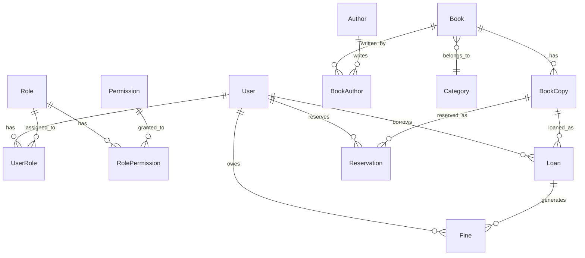
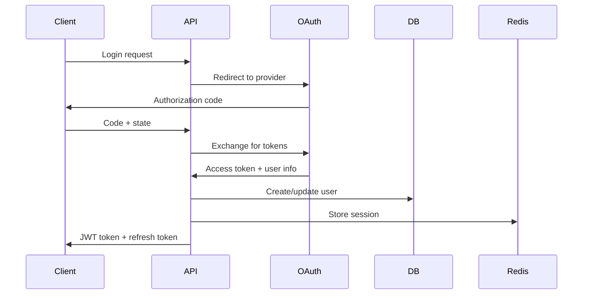

# Library Management System MVP - Architecture Plan

## Technology Stack Selection

### Backend Framework: FastAPI
**Why FastAPI?**
- Automatic API documentation (Swagger/OpenAPI)
- Built-in data validation using Pydantic
- Excellent async support for database operations
- Type hints for better code quality and IDE support
- High performance (comparable to NodeJS and Go)

### Database: PostgreSQL + Redis
**Why PostgreSQL?**
- ACID compliance for financial transactions (fines, payments)
- Advanced features like JSON columns, full-text search
- Excellent support for complex queries and joins
- Industry standard for production applications

**Why Redis?**
- Session management and JWT token blacklisting
- Caching for frequently accessed data (popular books, user profiles)
- Rate limiting for API endpoints

### ORM: SQLAlchemy 2.0 + Alembic
**Why SQLAlchemy 2.0?**
- Mature, battle-tested ORM with excellent async support
- Type safety with modern Python syntax
- Alembic for database migrations and schema versioning
- Excellent relationship handling for complex library data models

### Authentication: OAuth2 + JWT + RBAC
**Why OAuth2 + JWT?**
- Industry standard for secure API authentication
- Stateless tokens for scalability
- Support for third-party authentication (Google, GitHub)
- Role-Based Access Control (RBAC) for fine-grained permissions

### Validation & Serialization: Pydantic V2
**Why Pydantic V2?**
- Automatic request/response validation
- Clear error messages for API consumers
- Type conversion and data serialization
- Integration with FastAPI for automatic documentation


## Core MVP Features

### User Management
- **Staff Roles**: Admin, Manager, Librarian, Assistant
- **Member Management**: Regular members with borrowing privileges
- **OAuth2 Authentication**: Google/GitHub login + local accounts
- **Role-Based Permissions**: Granular access control per endpoint

### Catalog Management
- **Book Management**: Add, update, delete, search books
- **Author & Category Management**: Relationship modeling
- **ISBN Integration**: Validate and enrich book data
- **Inventory Tracking**: Available copies, condition status

### Circulation System
- **Book Borrowing/Returning**: Complete checkout workflow
- **Reservation System**: Hold books for future pickup
- **Fine Management**: Automated calculation and payment tracking
- **Renewal Policies**: Extend loan periods with business rules

### Reporting & Analytics
- **Usage Statistics**: Popular books, active members
- **Financial Reports**: Fine collection, revenue tracking
- **Operational Reports**: Overdue items, reservation queues
- **Export Capabilities**: CSV/PDF report generation


## Project Structure (Hexagonal Architecture)

```
library_management_system/
├── app/
│   ├── __init__.py
│   ├── main.py                      # FastAPI application entry point
│   ├── config/
│   │   ├── __init__.py
│   │   ├── settings.py              # Environment-based configuration
│   │   └── database.py              # Database connection setup
│   ├── core/                        # Business logic layer
│   │   ├── __init__.py
│   │   ├── auth/
│   │   │   ├── __init__.py
│   │   │   ├── oauth.py             # OAuth2 providers setup
│   │   │   ├── jwt_handler.py       # JWT token operations
│   │   │   └── permissions.py       # RBAC permission checks
│   │   ├── services/                # Business logic services
│   │   │   ├── __init__.py
│   │   │   ├── user_service.py
│   │   │   ├── book_service.py
│   │   │   ├── circulation_service.py
│   │   │   └── report_service.py
│   │   └── exceptions.py            # Custom exception classes
│   ├── models/                      # SQLAlchemy models (Domain layer)
│   │   ├── __init__.py
│   │   ├── base.py                  # Base model with common fields
│   │   ├── user.py                  # User, Role, Permission models
│   │   ├── book.py                  # Book, Author, Category models
│   │   ├── circulation.py           # Loan, Reservation, Fine models
│   │   └── audit.py                 # Audit trail for sensitive operations
│   ├── schemas/                     # Pydantic schemas (Data Transfer Objects)
│   │   ├── __init__.py
│   │   ├── user.py                  # User request/response schemas
│   │   ├── book.py                  # Book-related schemas
│   │   ├── circulation.py           # Circulation operation schemas
│   │   └── common.py                # Shared schemas and base classes
│   ├── api/                         # API routes (Presentation layer)
│   │   ├── __init__.py
│   │   ├── deps.py                  # Dependency injection functions
│   │   ├── v1/
│   │   │   ├── __init__.py
│   │   │   ├── auth.py              # Authentication endpoints
│   │   │   ├── users.py             # User management endpoints
│   │   │   ├── books.py             # Book catalog endpoints
│   │   │   ├── circulation.py       # Borrowing/returning endpoints
│   │   │   └── reports.py           # Analytics and reporting
│   │   └── middleware.py            # Custom middleware (CORS, rate limiting)
│   ├── repositories/                # Data access layer
│   │   ├── __init__.py
│   │   ├── base.py                  # Generic repository pattern
│   │   ├── user_repository.py
│   │   ├── book_repository.py
│   │   └── circulation_repository.py
│   └── utils/                       # Utility functions
│       ├── __init__.py
│       ├── security.py              # Password hashing, token generation
│       ├── email.py                 # Email notifications
│       └── helpers.py               # Common utility functions
├── tests/                           # Comprehensive test suite
│   ├── __init__.py
│   ├── conftest.py                  # Pytest configuration and fixtures
│   ├── unit/                        # Unit tests for services and utilities
│   ├── integration/                 # Integration tests for API endpoints
│   └── fixtures/                    # Test data fixtures
├── migrations/                      # Alembic database migrations
│   ├── versions/
│   ├── alembic.ini
│   └── env.py
├── docs/                           # API documentation
│   ├── api_documentation.md
│   └── deployment_guide.md
├── scripts/                        # Utility scripts
│   ├── init_db.py                  # Database initialization
│   └── create_admin.py             # Create initial admin user
├── docker/
│   ├── Dockerfile
│   ├── docker-compose.yml          # Multi-service setup
│   └── docker-compose.override.yml # Development overrides
├── .env.example                    # Environment variables template
├── requirements.txt                # Production dependencies
├── requirements-dev.txt            # Development dependencies
├── pyproject.toml                  # Poetry configuration (alternative)
└── README.md                       # Project documentation
```

## Architecture Explanation

### Hexagonal Architecture (Ports & Adapters)
This structure follows the hexagonal architecture pattern:

- **Core Domain** (`models/`, `core/services/`): Business logic independent of external concerns
- **Application Layer** (`api/`, `schemas/`): Orchestrates domain operations
- **Infrastructure Layer** (`repositories/`, `config/`): External system integrations
- **Adapters** (`api/v1/`): Interface adapters for HTTP, database, etc.

### Key Architectural Benefits
1. **Separation of Concerns**: Clear boundaries between layers
2. **Testability**: Business logic isolated from external dependencies
3. **Maintainability**: Easy to modify individual components
4. **Scalability**: Modular design allows for service extraction later

## Database Design



## Security Architecture

### OAuth2 Flow


### Permission System
- **Hierarchical Roles**: Admin > Manager > Librarian > Assistant
- **Resource-Based Permissions**: Create, Read, Update, Delete operations per resource
- **Context-Aware Authorization**: Users can only access their own data unless privileged

## Development Workflow

### Phase 1: Foundation (Files 1-8)
- Project structure and configuration
- Database models and migrations
- Basic authentication system

### Phase 2: Core Features (Files 9-16)  
- User management and RBAC
- Book catalog management
- Repository pattern implementation

### Phase 3: Business Logic (Files 17-24)
- Circulation system (borrow/return)
- Fine calculation and management
- Reservation system

### Phase 4: API & Integration (Files 25-32)
- RESTful API endpoints
- OAuth2 integration
- Comprehensive error handling

### Phase 5: Production Ready (Files 33-40)
- Testing suite
- Docker containerization
- Monitoring and logging
- API documentation

## Production Considerations

### Performance Optimizations
- Database indexing strategy
- Redis caching for frequently accessed data
- Async database operations
- Connection pooling

### Monitoring & Observability
- Structured logging with correlation IDs
- Metrics collection (Prometheus)
- Health check endpoints
- API rate limiting

### Security Hardening
- Input validation and sanitization
- SQL injection prevention
- CORS configuration
- Rate limiting per user/IP
- Audit logging for sensitive operations

## Future Enhancement Opportunities

Once you've mastered the core backend development concepts, this architecture is designed to easily accommodate future enhancements:

### Potential Future Additions:
- **Recommendation System**: Add collaborative filtering for book recommendations
- **Advanced Search**: Implement full-text search with PostgreSQL or Elasticsearch
- **Analytics Dashboard**: Add comprehensive reporting and data visualization
- **Mobile API**: Extend the API for mobile application support
- **Microservices**: Split into smaller services as the system grows
- **Event-Driven Architecture**: Add message queues for async processing

This architecture provides a solid foundation for learning modern backend development while following industry best practices. Each component serves a specific purpose and can be extended as your understanding grows.